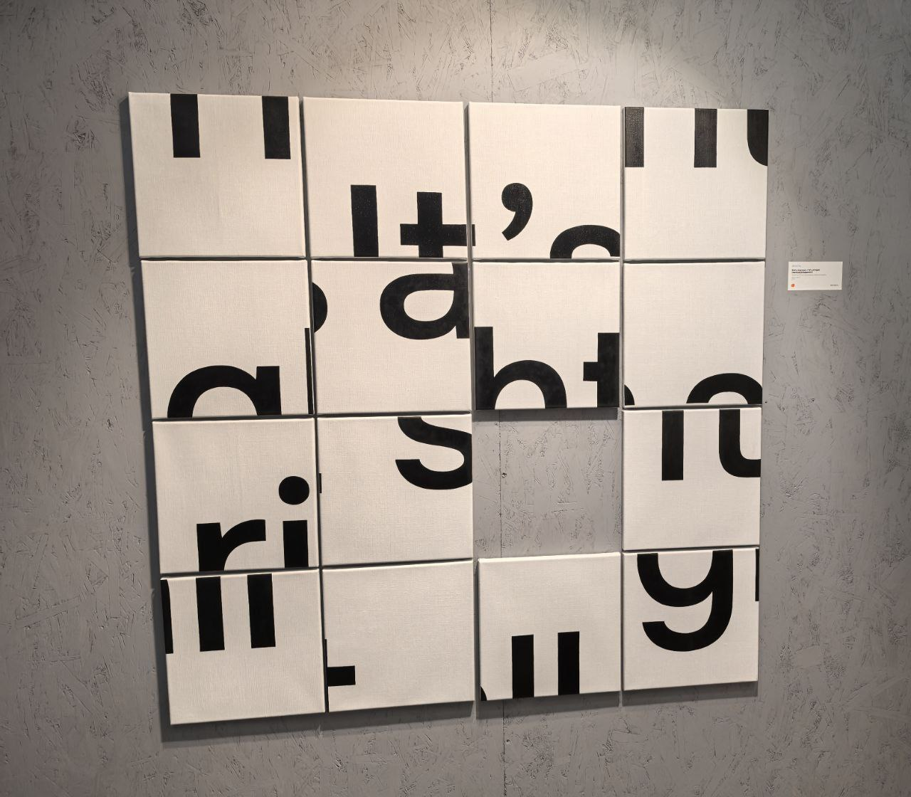
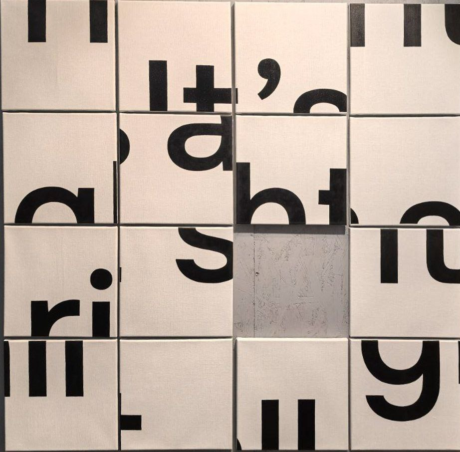

### Exhibition Art Image Solver

---

**Original image from exhibition**



**Solvable image**



**How to run solvers**

- Clone repository
  ```
  git clone https://github.com/senyor/art_solver.git
  ```
- Change directory
  ```
  cd art_solver
  ```
- Install Python 3
- Install requirements 
    ```
    python install -r requirements.txt
  ```

- To solve puzzle as Fifteen Puzzle game run
  ```
  python fifteen_puzzle_solver.py
  ```
- To solve puzzle as Simple Puzzle game run
  ```
  python image_swap_puzzle_solver.py
  ```
- Enjoy!

